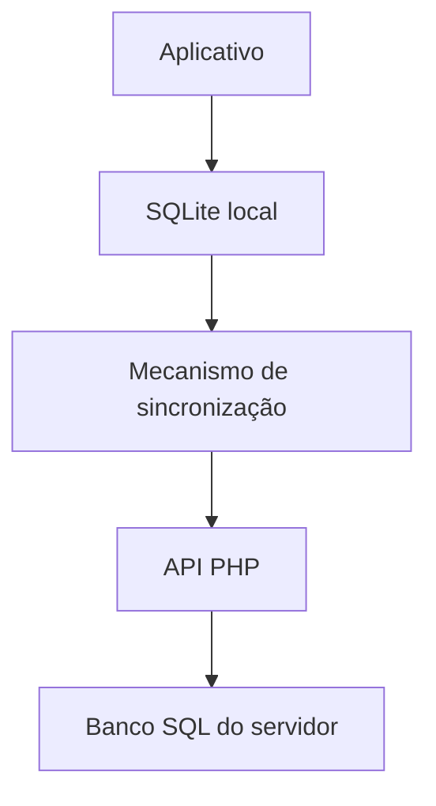

# Proviziona

**Planejamento financeiro local-first para transformar despesas futuras em aportes possíveis hoje.**

> Eu precisava disso.  
> Construí.  
> Você pode usar também.

O Proviziona ajuda a planejar gastos futuros — como impostos, assinaturas, manutenção, viagens ou compras maiores — dividindo cada objetivo em aportes acompanháveis ao longo do tempo.

O projeto está em fase inicial. Este repositório contém a fundação técnica e documental; ainda não há uma versão pronta para uso.

## Princípios

- **Local-first e offline-first:** o aplicativo deve funcionar normalmente sem internet.
- **Dados sob controle do usuário:** exportação e self-host fazem parte do produto.
- **Grátis de verdade:** as funções principais e o uso local não terão limitações artificiais.
- **Uma API, duas opções:** Proviziona Cloud e servidores self-hosted usarão o mesmo protocolo de sincronização.
- **Nuvem opcional:** a cobrança será pela infraestrutura e pela comodidade, não pelo acesso aos próprios dados.

> **O software é o produto. A nuvem é um serviço.**

> Você paga pela comodidade da nossa nuvem, não para ter acesso aos seus próprios dados.

## Modelo de domínio

O histórico financeiro não será representado apenas por um saldo acumulado:

```text
Provisionamento
└── Ciclo
    ├── Movimentação
    ├── Movimentação
    └── Movimentação
```

Exemplo:

```text
IPVA
├── Ciclo 2026
│   ├── aporte de R$ 100
│   ├── aporte de R$ 150
│   └── aporte de R$ 200
└── Ciclo 2027
```

Essa estrutura preserva histórico, simplifica auditoria e favorece recorrências e sincronização offline.

## Arquitetura planejada



- **Aplicativo:** HTML, CSS, TypeScript, Vite e Capacitor.
- **Persistência local:** SQLite.
- **Servidor:** PHP com o [framework Elavora](https://github.com/Elavora).
- **Base da API:** [Elavora API Skeleton](https://github.com/Elavora/api-skeleton).
- **Distribuição futura:** aplicativo local, self-host por Docker Compose e Proviziona Cloud.

Veja [a arquitetura inicial](docs/architecture.md) e [o roteiro do projeto](docs/roadmap.md).

## Estrutura do monorepo

```text
app/       Aplicativo local-first
server/    API e sincronização em PHP/Elavora
docs/      Decisões, arquitetura e documentação
docker/    Infraestrutura para self-host
```

As pastas ainda são pontos de partida e receberão os respectivos projetos nas primeiras etapas de desenvolvimento.

## Contribuições

O projeto está começando, mas contribuições já são bem-vindas. Antes de implementar uma mudança grande, abra uma issue para alinhar a solução.

Leia o [guia de contribuição](CONTRIBUTING.md) e a [política de segurança](SECURITY.md).

## Licença e autoria

Copyright © 2026 [Felipe dos Santos Cavalca](https://github.com/Felipe-Cavalca).

O Proviziona é distribuído sob a [GNU Affero General Public License v3.0](LICENSE). A licença permite uso, estudo, modificação e distribuição, inclusive comercial, desde que suas condições sejam respeitadas — incluindo disponibilizar o código-fonte das modificações cobertas quando o software for oferecido como serviço pela rede.

O projeto foi idealizado e criado por Felipe Cavalca e é mantido por ele com a ajuda de contribuidores. O histórico de commits, pull requests, releases e contribuidores registra a evolução e a autoria do trabalho.
