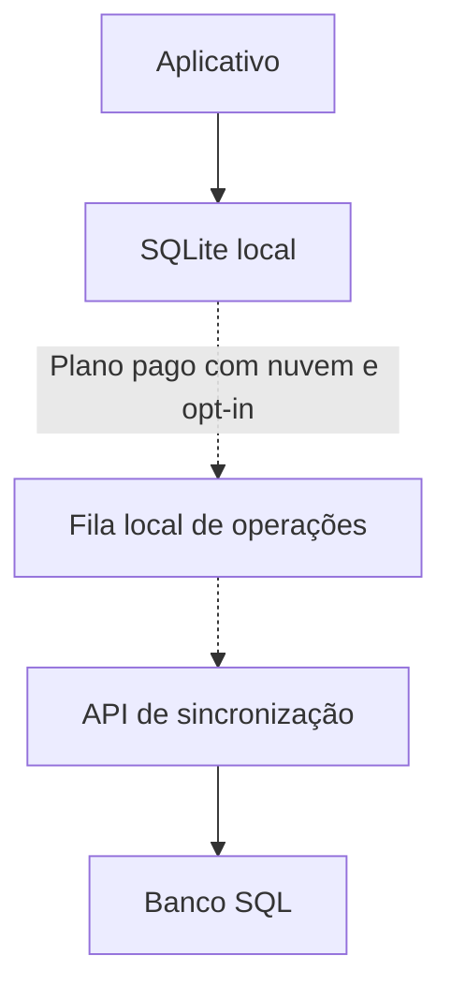

# Arquitetura inicial

Este documento registra a direção do projeto. Ele não congela detalhes que ainda precisam ser testados no MVP.

## Objetivos

- funcionar integralmente offline, sem conexão com qualquer servidor;
- operar sem conexão;
- manter os dados financeiros acessíveis no dispositivo;
- oferecer sincronização opt-in apenas para usuários com um plano pago que inclua nuvem;
- sincronizar múltiplos dispositivos de forma idempotente quando o recurso estiver habilitado;
- usar o mesmo protocolo na nuvem oficial e no self-host;
- preservar histórico e autoria das movimentações.

## Componentes

O SQLite atende imediatamente às operações do usuário e é a fonte operacional do aplicativo. Todas as funções locais devem continuar disponíveis sem conta, plano ou conexão com o servidor. A rede não participa do caminho crítico da interface nem é requisito para ler ou alterar os dados locais.

O servidor só participa quando o usuário possui um plano pago com direito à nuvem e ativa voluntariamente a sincronização. Nesse modo, ele autentica dispositivos, recebe operações, evita duplicatas e devolve alterações ainda não conhecidas pelo cliente.

## Modelo de acesso

O aplicativo local é gratuito e completo. Conta, sincronização e uso em múltiplos dispositivos são serviços de nuvem e dependem de um plano pago.

O cancelamento do plano encerra os serviços de nuvem, mas não remove, bloqueia nem limita os dados e as funções locais. Os níveis, limites e demais condições dos planos serão definidos futuramente. Esta decisão não estabelece condição comercial para self-host.

## Modelo de domínio

### Provisionamento

Representa o objetivo contínuo, como IPVA, assinatura anual ou troca de equipamento.

### Ciclo

Representa uma ocorrência do objetivo, como `IPVA 2027` ou a renovação anual de uma assinatura.

### Movimentação

Registra aportes, retiradas, ajustes e consumo do valor provisionado. O saldo é derivado dessas movimentações, não armazenado como a única fonte histórica.

## Diretrizes de sincronização

- a sincronização deve ser opt-in e permanecer desativada por padrão;
- conta, sincronização e múltiplos dispositivos devem exigir um plano pago ativo;
- o cancelamento do plano não pode apagar nem restringir dados ou funções locais;
- indisponibilidade, remoção ou ausência do servidor não pode bloquear funções locais;
- identificadores devem ser gerados no cliente;
- toda operação enviada deve possuir uma chave idempotente;
- repetir uma requisição não pode duplicar uma movimentação;
- exclusões relevantes devem ser representadas por tombstones ou eventos equivalentes;
- horários ajudam na ordenação, mas não podem ser a única regra de conflito;
- alterações de movimentações devem preferir correções explícitas, preservando auditoria;
- o protocolo deve ser versionado antes da primeira versão pública estável.

## Limites de confiança

O banco local é a fonte operacional para a experiência do usuário. O servidor é apenas a fonte compartilhada para sincronização entre dispositivos habilitados e nunca substitui a capacidade local de operar offline.

Autenticação, permissões de conta e associação de dispositivos pertencem ao servidor. Regras de domínio que possam ser executadas localmente não devem depender da nuvem.

## Decisões ainda abertas

- PostgreSQL ou MySQL como banco inicial do servidor;
- formato final do log de operações;
- política detalhada de resolução de conflitos;
- criptografia adicional de dados sincronizados;
- estratégia de migração do banco local e do protocolo.

Essas decisões devem ser registradas conforme forem implementadas e testadas.
