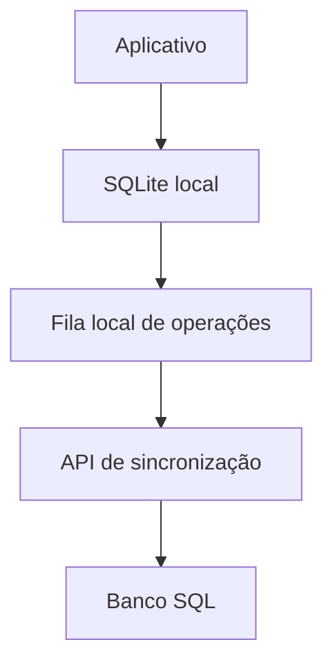

# Arquitetura inicial

Este documento registra a direção do projeto. Ele não congela detalhes que ainda precisam ser testados no MVP.

## Objetivos

- operar sem conexão;
- manter os dados financeiros acessíveis no dispositivo;
- sincronizar múltiplos dispositivos de forma idempotente;
- usar o mesmo protocolo na nuvem oficial e no self-host;
- preservar histórico e autoria das movimentações.

## Componentes

O SQLite atende imediatamente às operações do usuário. A rede não participa do caminho crítico da interface.

O servidor autentica dispositivos, recebe operações, evita duplicatas e devolve alterações ainda não conhecidas pelo cliente.

## Modelo de domínio

### Provisionamento

Representa o objetivo contínuo, como IPVA, assinatura anual ou troca de equipamento.

### Ciclo

Representa uma ocorrência do objetivo, como `IPVA 2027` ou a renovação anual de uma assinatura.

### Movimentação

Registra aportes, retiradas, ajustes e consumo do valor provisionado. O saldo é derivado dessas movimentações, não armazenado como a única fonte histórica.

## Diretrizes de sincronização

- identificadores devem ser gerados no cliente;
- toda operação enviada deve possuir uma chave idempotente;
- repetir uma requisição não pode duplicar uma movimentação;
- exclusões relevantes devem ser representadas por tombstones ou eventos equivalentes;
- horários ajudam na ordenação, mas não podem ser a única regra de conflito;
- alterações de movimentações devem preferir correções explícitas, preservando auditoria;
- o protocolo deve ser versionado antes da primeira versão pública estável.

## Limites de confiança

O aplicativo local é a fonte imediata para a experiência do usuário. O servidor é a fonte compartilhada para sincronização entre dispositivos.

Autenticação, permissões de conta e associação de dispositivos pertencem ao servidor. Regras de domínio que possam ser executadas localmente não devem depender da nuvem.

## Decisões ainda abertas

- PostgreSQL ou MySQL como banco inicial do servidor;
- formato final do log de operações;
- política detalhada de resolução de conflitos;
- criptografia adicional de dados sincronizados;
- estratégia de migração do banco local e do protocolo.

Essas decisões devem ser registradas conforme forem implementadas e testadas.
